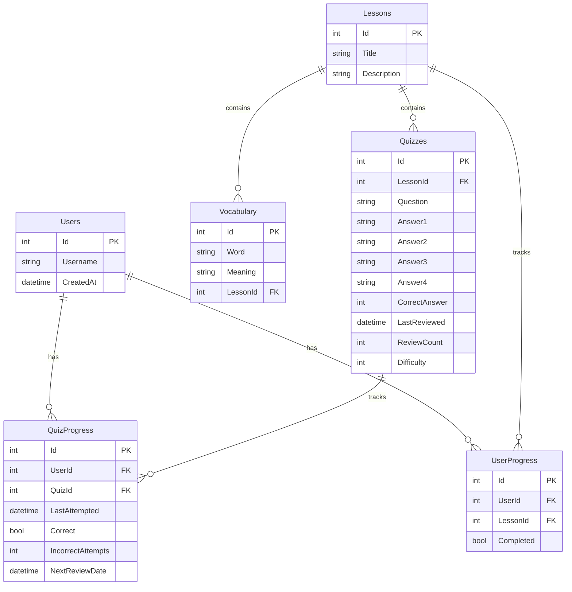

# Database Schema

## Entity Relationship Diagram



## Table Descriptions

### Users
Stores user information for multi-user support.

### Lessons
Contains the main learning content organized into lessons.

### Vocabulary
Stores Japanese words and their meanings, linked to specific lessons.

### UserProgress
Tracks user completion status for each lesson.

### Quizzes
Contains quiz questions and answers for each lesson.

### QuizProgress
Implements spaced repetition by tracking:
- User attempts
- Correct/incorrect answers
- Review intervals
- Next review dates

## Relationships

1. Users to UserProgress: One-to-many
   - Each user can have multiple lesson progress records

2. Users to QuizProgress: One-to-many
   - Each user can have multiple quiz attempt records

3. Lessons to Vocabulary: One-to-many
   - Each lesson contains multiple vocabulary words

4. Lessons to Quizzes: One-to-many
   - Each lesson contains multiple quiz questions

5. Lessons to UserProgress: One-to-many
   - Each lesson can have multiple user progress records

6. Quizzes to QuizProgress: One-to-many
   - Each quiz can have multiple attempt records

## Spaced Repetition Implementation

The quiz system uses a sophisticated spaced repetition algorithm implemented in the database:

### Question Selection Logic
```sql
CASE 
    WHEN qp.LastAttempted IS NULL THEN 0
    WHEN qp.NextReviewDate <= CURRENT_TIMESTAMP THEN 1
    WHEN qp.Correct = 1 THEN 2
    ELSE 3
END
```

### Review Intervals
- Correct answers: Exponential growth (2^n days)
  - First correct: 1 day
  - Second correct: 2 days
  - Third correct: 4 days
  - Fourth correct: 8 days
  - And so on...
- Incorrect answers: 1-hour interval

### Progress Tracking
- `LastAttempted`: Records when the question was last answered
- `Correct`: Boolean indicating if the last attempt was correct
- `IncorrectAttempts`: Counter for failed attempts
- `NextReviewDate`: Calculated based on performance
  - For correct answers: LastAttempted + (2^ReviewCount) days
  - For incorrect answers: LastAttempted + 1 hour 