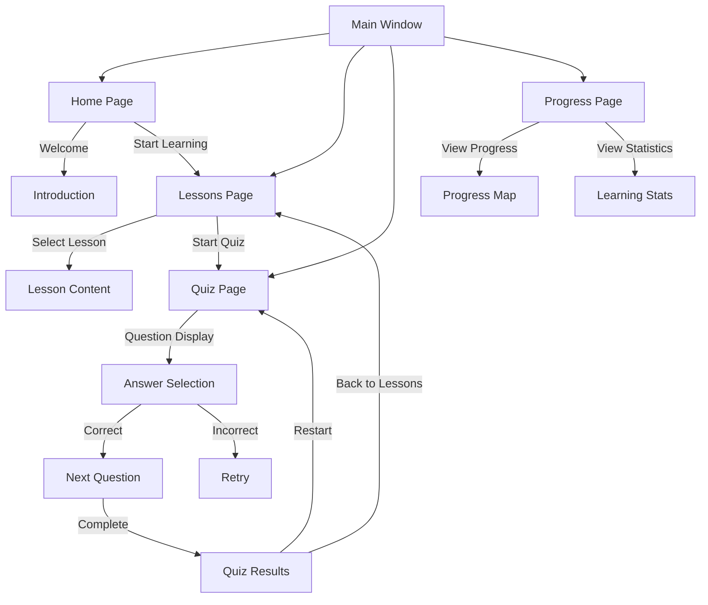

# UI Navigation

## Navigation Flowchart

## Page Descriptions

### Main Window
- Main application container
- Navigation menu
- Content frame

### Home Page
- Welcome message
- Introduction to Kumano Kodo
- Quick start options
- Navigation to lessons

### Lessons Page
- List of available lessons
- Lesson descriptions
- Progress indicators
- Quiz access

### Quiz Page
- Question display
- Answer selection
- Progress tracking
- Spaced repetition feedback
- Navigation controls

### Progress Page
- Kumano Kodo map visualization
- Progress indicators
- Learning statistics
- Achievement tracking

## User Flow

1. Application Start
   - Load Main Window
   - Initialize database
   - Show Home Page

2. Navigation
   - Use sidebar menu
   - Direct page links
   - Back/forward navigation

3. Quiz System
   - Select lesson
   - Answer questions
   - Get immediate feedback
   - Track progress
   - Review results

4. Progress Tracking
   - View overall progress
   - Check lesson completion
   - Monitor quiz performance
   - Track achievements 